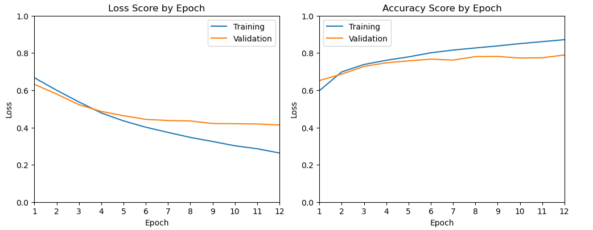

# Model Card

## Model Description

**Input:** The two inputs are [Steam](https://store.steampowered.com/) storefront review text and a label determing if the review was positive (1) or negative (-1).

**Output:** The outputs a positive (1) or negative (0) label for the review text along with the probability of it belong to that label.

**Model Architecture:** The model architecture is a [convolutional neural network (CNN)](https://en.wikipedia.org/wiki/Convolutional_neural_network) with pretrained weights from [GloVe](https://nlp.stanford.edu/projects/glove/). It is composed of an embedding layer, two convolutional layers, two max pooling layers, and a fully connected layer.

## Performance

The model achieves a 79.24% accuracy rate in classifying a Steam review as positive or negative. The data analysed was a subset of 10,000 reviews from the Steam storefront from a larger dataset of 6.4 million reviews. The dataset can be found distributed via [Zenodo](https://zenodo.org/records/1000885). It has also been made available via [Kaggle](https://www.kaggle.com/datasets/andrewmvd/steam-reviews). The performance was measured against the cross entropy loss on the validation set.

The final results can be found here: [final_results.csv](results/final_results.csv)\
Along with the final model checkpoint: [cnn_final.pt](checkpoints/cnn_final.pt)

|Batch Size|Max Tokens|Filter Size|Epoch|Training (Loss)    |Training (Accuracy)|Validation (Loss)  |Validation (Accuracy)|Testing (Loss)     |Testing (Accuracy)|
|----------|----------|-----------|-----|-------------------|-------------------|-------------------|---------------------|-------------------|------------------|
|1024      |512       |[3, 7]     |12   |0.2633             |0.8713             |0.4139             |0.7893               |0.4301             |0.7924            |

Performance over each of the 12 epochs were as follows.

## Limitations

The model has only been trained on reviews from the Steam storefront and therefore may have reduced accuracy on classifying text outside of the domain of video games.

## Trade-offs

On the author's machine, which has a mid-range Nvidia 1060 GPU, the model experienced performance difficults at high batch sizes when training with more than 100,000 instances.